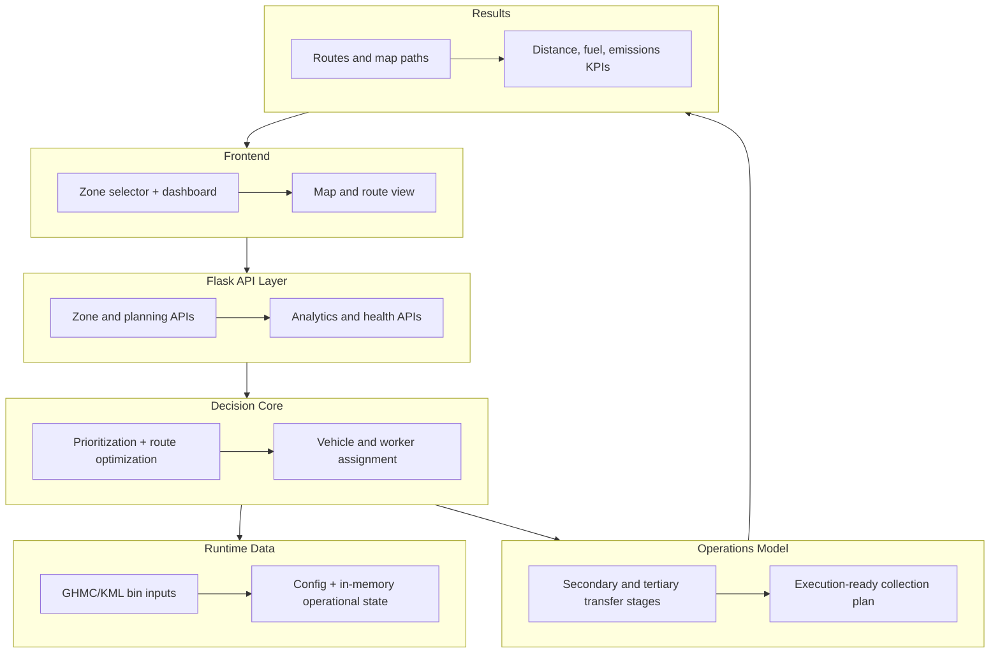

# Smart City Waste Collection - Balanced System Architecture

System flow (moderately simplified):
1. Frontend requests zone data or optimization runs from the Flask API.
2. API orchestrates core planners: zone prioritization, routing, and resource assignment.
3. Core planners consume runtime inputs (GHMC/KML data, config, and in-memory fleet/workers).
4. The operations model structures the plan across secondary and tertiary movement stages.
5. Results are returned as actionable routes, map layers, and KPI metrics.
